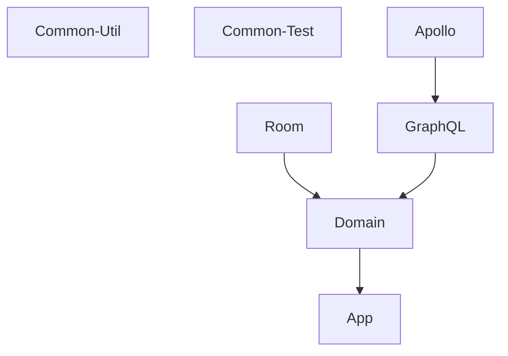

Rick And Morty Compose
=========

This is a Sample App utilizing some of the latest android technologies including

- [Jetpack Compose](https://developer.android.com/jetpack/compose)
- [Apollo Kotlin 3](https://www.apollographql.com/docs/kotlin/)
- [Room](https://developer.android.com/jetpack/androidx/releases/room)

All external data is from [Rick and Morty GraphQL API](https://rickandmortyapi.com/graphql)

https://user-images.githubusercontent.com/4791730/175387256-532cf86b-3a27-4245-8cba-8a06b1345e45.mp4

## Module Structure
Click on each for more info

## MAD Scorecard

